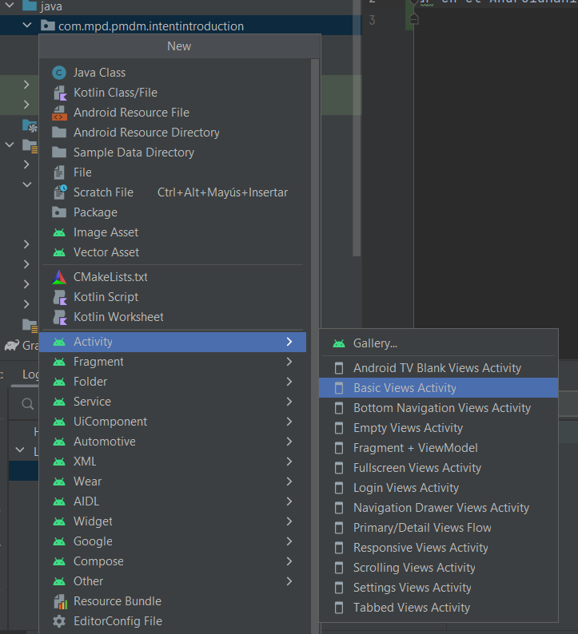

## Ejemplo de navegación entre Actividades mediante intents
 - Todas las actividades se deben reflejar en el AndroidManifest (lo hace el IDE si creamos con él la Actividad)

 - Para lanzar una nueva Actividad y pasarle datos:
``` 
val welcomeIntent = Intent(this, WelcomeActivity::class.java)
welcomeIntent.putExtra(FULL_NAME_KEY, fullName)
startActivity(welcomeIntent)
```
- En la actividad lanzada, podemos acceder al intent que ha lanzado la actividad y extraer la información pasada:
```
val fullName = intent.getStringExtra(FULL_NAME_KEY)
```

 - También existen **intents implícitos**, en los que indicamos de forma genérica qué queremos hacer (compartir, abrir mapa, etc...), pero no
qué actividad concreta debe atender dicha petición. Eso será elección del usuario. 

    Podéis ver el ejemplo de la guía de Android Developers https://developer.android.com/guide/components/intents-filters?hl=es-419#ExampleSend


